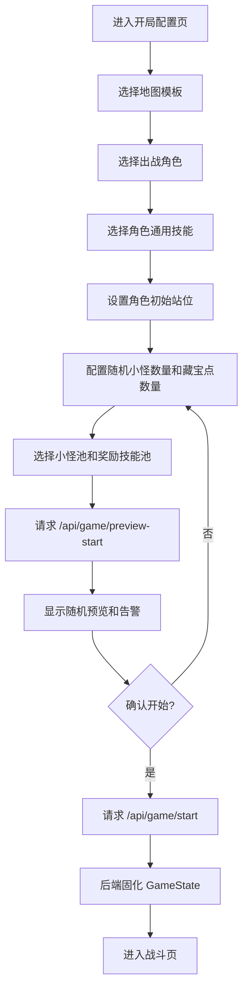
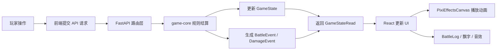
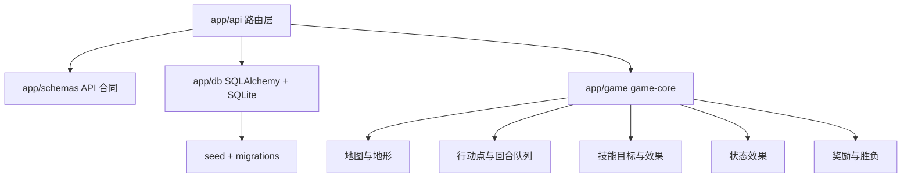

# I Love Game

一个本地优先的回合制网格战棋游戏原型。项目采用 FastAPI + SQLite 承载战斗规则、数据持久化和 API 合同，使用 React + Vite + TypeScript 实现地图编辑、角色/技能/小怪管理、开局配置和战斗界面。

当前主线版本为 **v2**。v2 的设计重点来自 `docs/codex_full_monster_random_terrain_animation_uiux_spec.md`：小怪系统、开局随机配置、地形规则升级、技能动画与 UI 反馈完善。

## 功能概览

- 回合制网格战斗：移动、普攻、技能、挖宝、击杀奖励、结盟和胜负判定。
- 角色系统：角色模板 CRUD、头像/棋子图片上传、属性和专属技能配置。
- 技能系统：内置技能、自定义技能、启用/禁用、复制、技能图标、通用技能和奖励池。
- 小怪系统：小怪模板 CRUD、固定/随机小怪入场、受击反击、死亡奖励。
- 地图系统：地图模板、可用格、部署区、固定小怪、固定藏宝点、随机预览。
- 地形系统：`normal`、`obstacle`、`lava`、`swamp`、`wood_stake`、`ice`、`thunderstorm`。
- 开局配置：在一个界面内完成地图、角色、技能、站位、小怪池、奖励池、随机数量和 seed 配置。
- 战斗表现：后端 `BattleEvent` 驱动前端音效、PixiJS 特效、伤害飘字和战斗日志。

## 技术栈

| 分层 | 技术 |
| --- | --- |
| 后端 | Python, FastAPI, Pydantic, SQLAlchemy |
| 数据库 | SQLite |
| 前端 | React, TypeScript, Vite |
| 动画/表现 | PixiJS, CSS 动画, Motion |
| 测试 | Pytest, TypeScript build |

## 快速启动

推荐使用根目录脚本：

```bat
start.bat
```

脚本会启动：

- 前端：`http://127.0.0.1:5173`
- 后端：`http://127.0.0.1:8000`
- API 文档：`http://127.0.0.1:8000/docs`

停止服务：

```bat
stop.bat
```

也可以手动启动。

后端：

```bash
cd backend
python -m uvicorn app.main:app --host 127.0.0.1 --port 8000 --reload
```

前端：

```bash
cd frontend
npm install
npm run dev
```

## 验证命令

后端测试：

```bash
cd backend
python -m pytest
```

前端类型检查和构建：

```bash
cd frontend
npm run build
```

## 系统流程

### 开局到战斗



### 战斗结算与表现



### 后端分层



## 项目结构

```text
backend/
  app/
    api/          FastAPI 路由，负责 HTTP 合同和错误转换
    db/           SQLAlchemy 模型、数据库连接、seed、轻量迁移
    game/         game-core，战斗规则、技能、地形、奖励和胜负判定
    schemas/      Pydantic 请求/响应模型
    tests/        API 合同测试
  data/           本地 SQLite 数据库，默认不提交
  uploads/        本地上传资源，默认不提交

frontend/
  public/         静态资源，例如地形贴图
  src/
    api/          API client
    audio/        音效管理
    components/   棋盘、实体、技能卡、战斗日志、战斗特效层
    data/         前端展示配置，例如地形定义
    pages/        首页、编辑器、开局配置、战斗页
    types/        前端类型定义

docs/             需求说明、阶段计划和实现规格
```

## 核心模块

后端规则集中在 `backend/app/game`，前端只负责交互与展示，不重新计算命中、伤害、胜负或奖励。

- 战斗入口：`backend/app/game/engine.py`
- 地图与地形：`backend/app/game/map_system.py`、`backend/app/game/terrain.py`
- 行动点：`backend/app/game/action_points.py`
- 回合队列：`backend/app/game/turn_queue.py`
- 技能模板：`backend/app/game/skills/skill_template.py`
- 技能目标：`backend/app/game/skills/targeting.py`
- 技能效果：`backend/app/game/skills/effect_engine.py`
- 状态效果：`backend/app/game/status/status_engine.py`
- 奖励与胜负：`backend/app/game/reward.py`、`backend/app/game/victory.py`
- 小怪与召唤物扩展：`backend/app/game/models.py`、`backend/app/game/summons.py`

前端主要页面：

- `/`：首页
- `/characters`：角色编辑器
- `/maps`：地图编辑器
- `/skills`：技能管理器
- `/monsters`：小怪管理器
- `/setup`：开局配置
- `/battle/:gameId`：战斗界面

## API 概览

| 能力 | 接口前缀 |
| --- | --- |
| 角色模板 | `/api/characters`、`/api/character-templates` |
| 小怪/生物模板 | `/api/monster-templates`、`/api/creature-templates` |
| 技能模板 | `/api/skills/templates` |
| 技能图标 | `/api/skills/icons/{skill_id}.svg` |
| 地图模板 | `/api/maps` |
| 开局预览 | `/api/game/preview-start` |
| 正式开局 | `/api/game/start` |
| 战斗操作 | `/api/game/{game_id}/move`、`basic-attack`、`use-skill`、`dig-treasure` |
| 上传 | `/api/uploads`、静态访问 `/uploads/...` |

## 版本管理

### v1：基础战棋框架

v1 建立了项目的基础可玩闭环：

- 角色、地图、技能模板的基础 CRUD。
- FastAPI + SQLite 的本地数据持久化。
- React/Vite 前端页面框架。
- 网格地图、行动点、回合队列、普攻、技能释放。
- 击杀奖励、藏宝点、基础战斗日志。
- 前后端类型和 API 合同初步对齐。

### v2：随机开局、小怪、地形和表现升级

v2 相对 v1 的主要升级：

- 新增小怪模板和小怪管理页。
- 小怪成为战斗占格实体，支持固定放置、随机生成、受击反击和死亡奖励。
- 开局随机性统一收敛到开局配置页，支持随机小怪数量、随机藏宝点数量、小怪池、奖励技能池和 `startSeed`。
- 新增 `/api/game/preview-start`，支持正式开局前预览随机结果。
- 正式开局后将随机结果固化进 `GameState`，战斗中不再临时生成随机实体或实时读取全局奖励池。
- 地图模板只保存固定结构：格子、地形、固定小怪、固定藏宝点、部署区域。
- 地形扩展为 `normal`、`obstacle`、`lava`、`swamp`、`wood_stake`、`ice`、`thunderstorm`。
- 移动消耗改为由当前格子的 `terrain.leaveCost` 决定。
- 障碍物阻挡移动、部署和直线技能。
- 岩浆、沼泽、木桩、冰面、雷暴具备独立规则和测试目标。
- 技能表现升级为后端 `BattleEvent` + 前端动画层，动画不参与规则结算。
- 前端战斗界面增加 PixiJS 特效、音效、飘字、动作预览和更明确的操作反馈。


Git tag 示例：

```bash
git tag -a v2.0.0 -m "Release v2.0.0"
git push origin v2.0.0
```

## 开发约定

- 规则只写在 `backend/app/game`，前端不要复制战斗判定逻辑。
- 修改 API 字段时同步更新 `backend/app/schemas` 和 `frontend/src/types`。
- 新增数据库列时补充 `backend/app/db/migrations.py`，不要只依赖 `create_all()`。
- 新增技能效果时优先扩展 `EffectType`、目标解析、效果执行和后端测试。
- 新增地形时同步后端规则、Pydantic schema、前端类型、前端展示和地图编辑器。
- 本地数据库、上传素材、缓存和构建产物不进入 Git。

## GitHub 上传建议

如果这是第一次整理 GitHub 仓库，先让 `.gitignore` 生效，并把已经被 Git 跟踪的本地生成文件从索引中移除：

```bash
git status --short
git rm -r --cached --ignore-unmatch ":glob:**/__pycache__" ":glob:**/*.pyc" ".pytest_cache" "backend/.pytest_cache" "backend/data/game.db" "backend/uploads" "frontend/node_modules" "frontend/dist" "frontend/test-results" "test-results" ".codex" "I_love_game.code-workspace"
git add .gitignore README.md
git status --short
```

确认状态里不再准备提交数据库、缓存、构建产物和本地上传资源后，再提交源码：

```bash
git add backend/app frontend/src frontend/public docs requirements.txt start.bat stop.bat frontend/package.json frontend/package-lock.json frontend/tsconfig.json frontend/vite.config.ts frontend/index.html
git commit -m "Prepare project for GitHub"
git branch -M main
git remote add origin https://github.com/<your-name>/<your-repo>.git
git push -u origin main
```

如果已经配置过远程仓库，`git remote add origin ...` 会报已存在。此时改用：

```bash
git remote set-url origin https://github.com/<your-name>/<your-repo>.git
```

`backend/uploads` 中如果有想作为演示素材公开的图片，建议移动到 `frontend/public/demo-assets` 或单独建示例资源目录，再显式提交。
